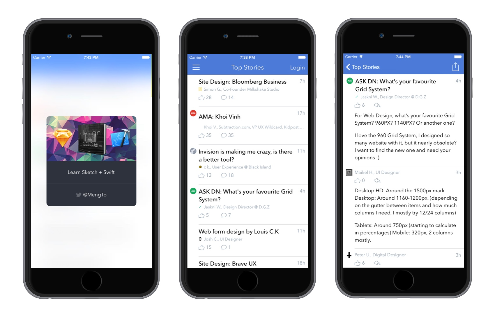
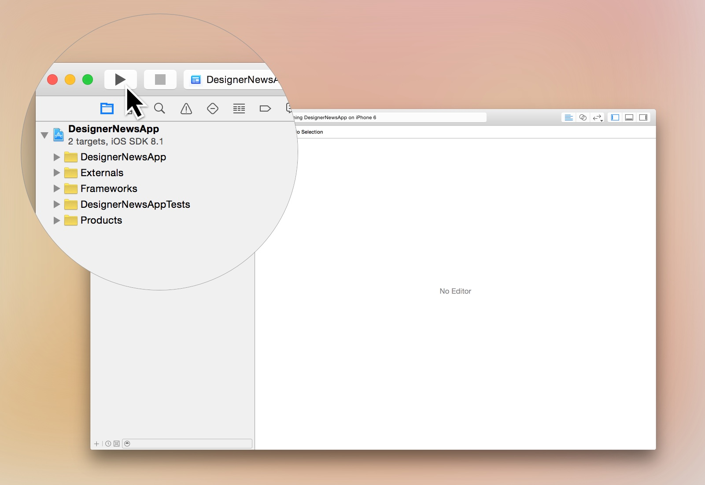

# DesignerNewsApp



Simple [iOS client](https://itunes.apple.com/us/app/designer-news-app/id879990495?ls=1&mt=8) for [Designer News][], by the creator of [Design+Code][] and the team, written in Swift.

## Usage

1) Download the repository

```
$ git clone https://github.com/MengTo/DesignerNewsApp.git
$ cd DesignerNewsApp
```
    
2) Initialize submodule dependancies

```
$ git submodule update --init --recursive
```

3) Open the project in Xcode

```
$ open DesignerNewsApp.xcodeproj
```

4) Compile and run the app in your simulator



# Requirements

- Xcode 6.3
- iOS 8

# Credits

- [Alamofire][] for network request
- [DTCoreText][] for fast and efficient HTML content display
- [Spring][] for code-less animation

[Alamofire]:https://github.com/Alamofire/Alamofire
[DTCoreText]:https://github.com/Cocoanetics/DTCoreText
[Design+Code]:http://designcode.io
[Designer News]:https://news.layervault.com
[Spring]:https://github.com/MengTo/Spring
